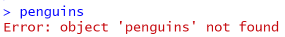
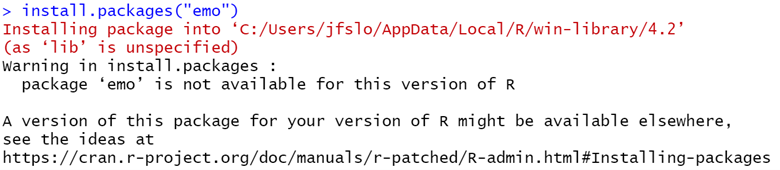
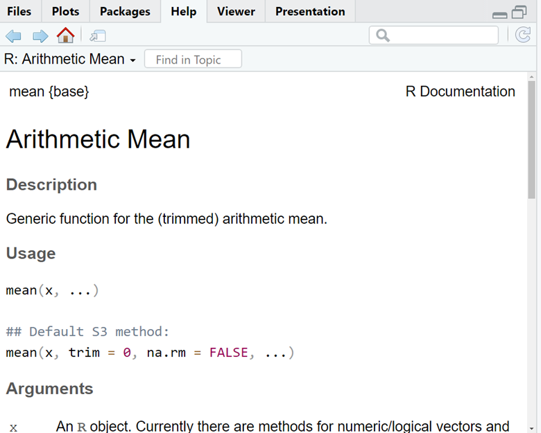

```{r setup, include=FALSE}
knitr::opts_chunk$set(echo = TRUE, warning=FALSE, message=FALSE)
```

## Packages

A package is a collections of code, data, and documentation all bundled together in a standardized way that can be easily shared and installed by other R users.

- **Installing packages**: when you want to use a package for the first time, you must install the package with `install.packages("package_name")` - note the package name must be in quotes. You only need to install a package 1 time on your local computer, so I suggest using the console to install packages.
- **Loading packages/libraries**: every time you start a new session, you have to tell R what packages you want to load in. You do this with the `library(package_name)` - note the package name does not need to be in quotes here.

### Palmerpenguins 

To start, let's have a look at the `palmerpenguins` package.

- In the `palmerpenguins` package, there is a dataset called `penguins`. Therefore, when you install and load in the package, you will automatically have access to this dataset. 
- However, if we try to run `penguins` before we install or load in the package, we will get an error message:

```{r eval=FALSE, echo=FALSE}
penguins
```

```{r, echo=FALSE, width = "95%"}

```

- But once we install and load in the `palmerpenguins`, we can see the penguins dataset!

```{r}
# install.packages("palmerpenguins")

library(palmerpenguins)
penguins
```


### Tidyverse

Tidyverse is a package, well it's actually a collection of 8 packages (ggplot2, dplyr, tidyr, readr, purrr, tibble, stringr, forcats) introduced by Hadley Wickham to help with data manipulation, exploration, and visualization.

- You can check out [the tidyverse](https://www.tidyverse.org/packages/){target="_blank"} to find out more details of each of the individual packages.

- Whenever you load tidyverse, you'll see a message saying it’s attaching all 8 packages. Therefore, you don’t have to load in any of the individual packages because they all get loaded in together. This means as long as you load in `tidyverse`, you can use [functions](https://r4beginners.com/lessons/lesson4-packages-functions/#functions){target="_blank"} from any one of the 8 packages.

```{r message=TRUE}
# install.packages("tidyverse") # run in console

library(tidyverse)
```

### Errors installing new package...what do you do when you encounter errors?

If you are an active R user, I can almost guarantee that sooner or later you will run into error messages when trying to install an R package. So what do you do when this happens? To see, let's go through an example.

Let's say we discovered there's an `emo` package that let's us insert emojis and we want to install the package. 

1. Like any other package, the first thing we do is try to install the package in the console with the following code:

```{r eval=FALSE, echo=FALSE}
install.packages("emo")
```

```{r, echo=FALSE, out.width = "95%"}

```

- Unfortunately, we get a warning message `package 'emo' is not available for this version of R`. At first, this may be a little misleading because you may think the issue is that you do not have the right version of R. 
- But, really the problem is this package does not exist on **Comprehensive R Archive Network (CRAN)** and the `install.packages()` function only works for packages that are part of CRAN.
- One way to check if the package is part of CRAN is to navigate to the Packages tab (by default, this should be located in the bottom right panel of RStudio) and type in the package you're interested in installing. 
- We can see that `emo` is not there.
- So, if the package is not part of CRAN, what should you do?

2. Turn to Google! I typically go to Google and search “install package X in R”.

3. Find the package repository on GitHub. If packages aren't on CRAN, you should be able to find the package repository on GitHub and then you can install the package via devtools (another package). 
  - When I search for the `emo` package on Google, this is the first link: [Emo GitHub Repository](https://github.com/hadley/emo){target="_blank"}. 
  
4. On the GitHub Repository, scroll down and look for instructions on how to install the package. 
- The code below is taken directly from the website (note, you do have to install the devtools package if you haven't already done so). 
- All you have to do is run this code in your console and you'll be able to install the `emo` package!

```{r eval=FALSE}
# install.packages("devtools")
devtools::install_github("hadley/emo")
```

- As a small aside, note that we don't have to call the library for `devtools` in the code above because we are explicitly telling R that the `install_github` function is from (`::`) the `devtools` package. 
- The code above is identical to running the code in two lines like this:

```{r eval=FALSE}
# install.packages("devtools")
library(devtools)
install_github("hadley/emo")
```

- Let's test it out our new `emo` package!

*Remember, it's not enough to install the package. We also have to load the library.*

```{r}
library(emo)
ji("smile")
```

- Finally, I want to share this [installing packages blog](https://www.littlemissdata.com/blog/r-package-install) that I found super helpful, especially this screenshot of a flow chart on "Approaching Package Issues Systematically": 

```{r, echo=FALSE, out.width = "95%"}
knitr::include_graphics("images/packages-tree-diagram.png")
```

## Functions

A function is a set of statements (or code) organized to perform a specific task. Essentially, a function is like a black box where you enter inputs and you get an output. R has a lot of built-in functions. 

For example, there's a `mean()` function that calculates the average of the data you include in the function.

- Here we can easily calculate the mean of `my_values`:

```{r}
my_values = c(10,20,30)

mean(my_values)
```

### Arguments

An argument is the information passed into any given function. In the example above we passed in one argument consisting of "my_values". The output returned the average of 10, 20, and 30. 

As another example of this function, let's say we wanted to get the average bill length of the penguins in the palmerpenguins dataset.

- Here, we have to specify the dataset *and the column of data* we want to use in our mean calculation. We can do this by using the `$` operator. 
- However, if we run the code below, we get a strange result: 

```{r}
mean(penguins$bill_length_mm)
```

- Why did we get NA? We cannot calculate a mean score if there are NA values, so we need to remove these values.
- Fortunately, there is an **argument** that let's us do just that: "na.rm = TRUE" (remove NA = TRUE).

```{r}
mean(penguins$bill_length_mm, na.rm = TRUE)
```

- We can turn to the help documentation to see the different arguments of a function.

### Help Documentation

- If you are using a function for the first time, you may not know where to start. 
- One useful tool is R's help documentation (the help tab in the bottom right panel).
- You can simply search for the function name to learn more about the function. For example, the documentation provides a description, usage, arguments, and often even examples.
  - As a shortcut you can also type a ? followed by the function name in the console. For example, `?mean` which will take you directly to the help documentation for the mean function. 

### `mean()` Help Documentation 


```{r, echo=FALSE, out.width = "95%"}

```

- First, we immediately see the description: "Generic function for the (trimmed) arithmetic mean".
- Then, we can see that the usage says: "mean(x, ...)"
  - This means that we need to provide an argument for x. If we scroll down a bit further we can see that x is defined. Basically, this is saying that in order to calculate a mean score, you need to put in some data (aka x)
  - The `...` tells us that there are other arguments, but they are not required. For example, the "na.rm" is one argument, but it is not required.
- Next, we see a list of the different possible arguments. 
- And if you scroll all the way down to the bottom, you will see examples of how to use the function.  

### Why Use Functions?

- Functions save us a lot of time! We often rely on functions that other people have written. So, while we could have taken the time to write our own `mean` function, there's no need to because the function already exists. It should hopefully be clear from the last example how powerful the `mean` function can be and how much time it can save us. 

- You can create your own functions specific to your code and your tasks. As a general rule, if you find yourself writing the same code more than twice, you should consider writing a function. Using functions can reduce your chances of making errors. For example, if you need to update your code and you have a function, you only need to update it in one place. However, if you have the same code written 5 times, there's a pretty high chance that you'll forget to update your code somewhere, which will result in an error. 

- Although writing your own function is beyond the scope of this lesson, here are some useful websites if you wish to learn more: 

- [R for Data Science: Functions](https://r4ds.had.co.nz/functions.html)
- [How to create your own functions in R](https://www.r-bloggers.com/2022/04/how-to-create-your-own-functions-in-r/)


## Summary 

In this lesson we first learned about packages Specifically, we learned how to install packages for the first time and how it's necessary to "load" in a package using the `library()` function every time you start a new R session. We also went through an example of what to do when you encounter an error message after running `install.packages()`. 

We also learned about functions and why we should use functions. Importantly, we introduced R's Help Documentation, which is a great resource if you are using a function for the first time and not quite sure where to start. 


## Exercises

1. Load in the packages `palmerpenguins` and `tidyverse` and print the penguins dataset.

```{r}

```

2. Notice that when you printed the penguins variable, it printed either in your console or directly below your code, but it did not save the variable in your environment. 

Now, save the penguins dataset to a new variable called `penguins_data` and then print `penguins_data`. 

```{r}

```

3. Using the help documentation, look up the function `head()`. See if you can understand what this function does.

*Hint: in the console, use a ? followed by the function name.*

4. Use the `head()` on the `peguins_data`.

```{r}

```

5. Return to the help documentation for `head()`. In the description, it mentions a second function that is the opposite of `head()`, what is that function? Test it out on the `penguins_data`. 

```{r}

```

6. What is the average flipper length for all of the penguins in our dataset?

*If you get stuck, review the example above where we calculate the average bill length.*

```{r}

```


## THE END `r emo::ji("tada")` 
