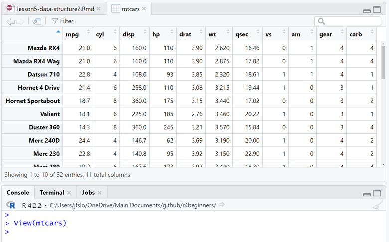
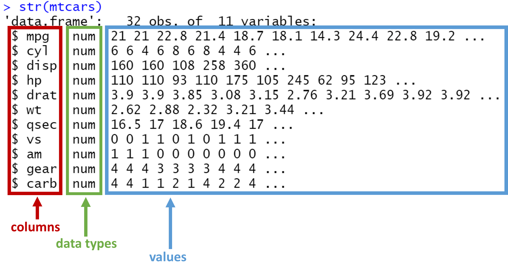

```{r setup, include=FALSE}
knitr::opts_chunk$set(echo = TRUE, warning=FALSE, message=FALSE)
```

In the previous Data Structure lesson we reviewed vectors, matrices, and arrays. And now in this lesson we will review:

- Data frames
- Tibbles

## Data frames

- A data frame is a common way of storing data in R. 
- In data frames, the columns are the different variables of the data set and the rows are unique observations.
- This may sound similar to matrices, but matrices can only have one type of data. 
- Data frames can have variables of different types. For example, one variable may be a character and one may be numeric. 
- R has several built-in data sets formatted into data frames (e.g., `mtcars`, `iris`, `toothgrowth`, and more). 

### `mtcars` example

Let's take a look at `mtcars`:

```{r}
mtcars
```

- R returns the entire data frame, so if you're like me and like to view your output in the console of RStudio, you'll probably need to scroll up in order to see first row along with the variables.
- We can see there are 11 variables, but it's hard to know exactly how many rows (or observations) there are.
- We can type `?mtcars` into the console to get more information. 
<!-- Similar to how we can use the ? to look up functions, we can also use the ? to look up built-in R data sets like mtcars.   -->
- Here, we can see there are 32 observations and we can see what each variable is.

### Helpful Functions to Explore Data Frame

We can also use existing [functions](https://r4beginners.com/lessons/lesson4-packages-functions/#functions){target="_blank"} to help us understand our data better:

- `head()` returns the top 6 rows. This doesn't actually give us any new information about our data set, but it's a really useful function to know about because it's helpful to be able to get a view of the first several rows along with the variable names. 

```{r}
head(mtcars)
```

1. `View()` allows you to view the data frame in a new window, making it easier to explore the full data set.

```{r eval=FALSE}
View(mtcars)
```

```{r, echo=FALSE, width = "95%"}

```

2. `nrow()` returns the total number of rows in your data frame.

```{r}
nrow(mtcars)
```

3. `ncol()` returns the total number of columns in your data frame.

```{r}
ncol(mtcars)
```

4. `str()` returns the "structure" of our data frame in a compact way. 

  - We can see the number of observations and number of variables. 
  - We can also see a bit more information about each variable. For example, we can see that all of the variables in `mtcars` are numeric. It even lists the first several observations for each variable. 
  - `glimpse()` is a similar function to `str()`. I encourage you to try it out!

```{r}
str(mtcars)
```

```{r, echo=FALSE, width = "95%"}

```

5. `summary()` provides a summary of the different variables. Because all the variables are numeric, we can see the summary function returns the following information: minimum value, 1st quartile (25th percentile), median, mean, 3rd quartile (75th percentile), and maximum value.  

```{r}
summary(mtcars)
```

- What if we only wanted to get a summary of the first variable, mpg? No problem, we can modify the code like this:

```{r}
summary(mtcars$mpg)
```

## Tibbles

A tibble is a type of data frame with some special features that we will explore. If you use `tidyverse`, chances our you'll see a lot of tibbles! 

There are some differences between tibbles and data frames, but those are not important when learning the basics. We'll go through the basic differences, but here's a useful link if you're interested in learning more about tibbles: [tibble.tidyverse.org](https://tibble.tidyverse.org/){target="_blank"}.

### `Penguins` example

To understand the unique features of a tibble, we'll explore the `penguins` data set that is included in the `palmerpenguins` package.

In the last lesson, we learned about packages. We know the first things we need to do is load the package and then we will have access to the penguins data set.

```{r}
library(palmerpenguins)
penguins
```

- The first line of output says: "A tibble: 344 x 8". Straight away, we get confirmation that this data frame is a tibble. And there are 344 rows and 8 columns. 
- Because tibbles are a type of data frame, similar to what we saw with the `mtcars` data frame, each column is a variable and each row is a unique observation. 
- Just to confirm, we can run the following 2 lines of code to see that penguins is both a data frame and a tibble:

*Note: `is_tibble()` is a function in the `tibble` package, which is part of `tidyverse`, so we need to load in the `tidyverse` library first.*

```{r}
library(tidyverse)

is.data.frame(penguins)
is_tibble(penguins)
```

### So what is special about tibbles?

  - Tibbles are simple data frames with some features that make working with the data really nice.
  - As already pointed out, the tibble shows us exactly how big our data set is (344 rows and 8 columns).
  - It automatically only prints out the first 10 rows, so it's much easier to see the variables in our data set. 
  - Under each variable name, we see what type of variable it is (e.g., fct, dbl, int, etc.)
    - *As a small aside, tidyverse uses "dbl" ("double") instead of "numeric", but they are identical.*
  - R only returns the number of columns that fit on your screen. For example, if you view your output in the console, it's likely that not all of the variables will neatly fit on your screen. Under the 10 rows of data, you may see something like: "and 1 more variable: year <int>". This is great because you get important information on all of the variables even if there are too many to fit on your screen. 

### Converting a data frame to a tibble

- Recall, that by default mtcars is a data frame and not a tibble, 

```{r}
mtcars
```

- However, we can easily use the `as_tibble()` function to convert it to a tibble. 

```{r}
as_tibble(mtcars)
```

- This example should highlight the advantages of working with tibbles.
- Personally, I try to work exclusively with tibbles because I find it so much easier and cleaner. 

### Create our own tibble

In the [Data Structure: Part 1 lesson](https://r4beginners.com/lessons/lesson3-data-structure/){target="_blank"}, we created three vectors: `names`, `age`, and `blue_eyes`. Now, let's create a tibble consisting of these three vectors. 

- We will use the `tibble()` function.
- Each line of our tibble represents a unique variable (or column). The text to the left of the equals sign is the variable name and the text to right is the data we want to be stored in our tibble. For example, `Name` is variable name for the first column and the data is our `names` vector (Josh, Jenny, Brandon).
- We will save our tibble as `my_tibble()`.

```{r}
names <- c("Josh", "Jenny", "Brandon")
ages <- c(31, 30, 27)
blue_eyes <- c(TRUE, FALSE, FALSE)

my_tibble <- tibble(
  Name = names,
  Age = ages,
  Blue_eye = blue_eyes
)

my_tibble
```

- And just like that, we created our very own 3x3 tibble!

## Summary 

In this lesson we learned about data frames and tibbles. Data frames are one of the most common ways of storing data, where each column represents a variable and each row represents an observation. Tibbles are a type of data frame with special features that make it even easier to work with.  


## Exercises

1. R has a built-in dataset called `airquality`. Type `airquality` into the R chunk below and run the code to see this data. 

```{r}

```

2. Is this a standard data frame or is this a tibble? Use the `is.data.frame()` and `is_tibble()` functions to confirm.

*Hint: make sure you have the `tidyverse` library loaded before executing the `is_tibble() function.*

```{r}

```

3. Now that we know `airquality` is not a tibble by default, use the `as_tibble()` function to convert it to a one. 

Save this to a new variable called `airquality_tibble`. 

Print `airquality_tibble` to see the results. 

```{r}

```

4. Can you answer the following questions:

- How many columns does this dataset have? 
- How many rows? 
- What are the row names?
- What year are these data points from? *Hint: use the help documentation by typing `?airquality` in the console.*

5. Use the `View()` to view the data in a new tab. 

6. Get the summary results of the wind variable. 

```{r}

```


6. Find the average temperature of all the observations in this dataset. 

```{r}

```


## THE END `r emo::ji("tada")` 
